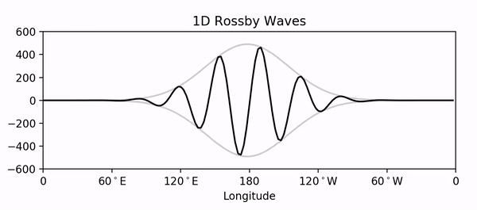

# simple-atmospheric-models
Code for simple models of the atmosphere (and ocean)

This is a repository for code I have used to make class examples -- some graphics using the output of the codes are shown further below. Unfortunately, several of the programs need to be completely re-coded for clarity and none of them have been carefully tested, so please use with caution. My goal is to eventually produce well-tested Python versions of all the programs here but I haven't figured out a way to get funding for that, so it remains a very slowly moving hobby project. If you find any errors, please contact me at Mathew_Barlow@uml.edu .

<b>baro_1d_1.0.f</b>
 Solves the linearized barotropic vorticity equation in one spatial dimension (longitude). No external libraries, should run with gfortran. Produces a binary output file, no plotting included (a GrADS control file is included in the 'grads' folder).

<b>lbve_sbr_1.0.f</b>
 Solves the linearized barotropic vorticity equation on a sphere, for idealized El Nino forcing with a basic state of solid body rotation. No external libraries, should run with gfortran. Produces a binary output file, no plotting included (a GrADS control file is included in the 'grads' folder).

<b>two_layer.f</b>
 Solves the two-layer baroclinic model from Holton (4th ed), should run with gfortran. Coded by a student as a very impressive project but needs to be recoded for clarity. Produces a binary output file, no plotting included (a GrADS control file is included in the 'grads' folder).

<b>inertial_oscillations_1.1.py</b>
 Calculates trajectories for inertial oscillations and plots the results.

 

<b>More Information</b>

 

The following animation was made from the output of <b>baro_1d_1.0.f</b>, using a separate plotting routine (which was also used to add the envelope):

The following graphic was made from the output of <b>lbve_sbr_1.0.f</b>, using a separate plotting routine:

The following animation was made from the output of <b>two_layer.f</b>, using a separate plotting routine:

<b>inertial_oscillations_1.1.py</b> numerically calculates trajectories for inertial oscillations, given a starting location and wind, and makes the plot shown below.  The analytic solution for constant f is included for comparison and validation. The code solves the equation set:    du/dt = fv
  dv/dt = -fu

<b>inertial_oscillations_anim_1.1.py</b> does the same calculation, but makes an animated gif of the trajectory

